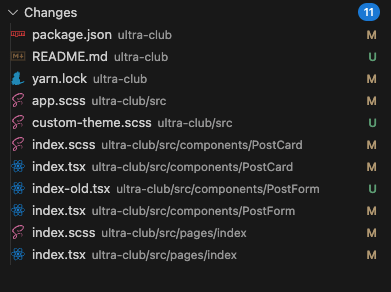

# ultra-club

> 学习参考：[Taro 小程序开发大型实战](https://juejin.cn/post/6844904032125845517?searchId=202307201149193D68710E5B0E2DEB7B9B)

## 用 useState 来重构我们的 index 页面

我们用 useState 来重构我们的 index 页面。具体地，我们将整个 Index 组件转换成函数式组件，然后之前的三个状态都用 useState 来创建

修改或升级的原文件保留并重命名，如下：

原文件 `pages/index/index-old.tsx` --> `pages/index/index.tsx`

## 添加新的帖子 UI 升级，使用 Taro ui

三点改进：

- 通过点击一个浮动按钮（Fab）来触发创建新文章的浮动弹层（FloatLayout）

* 发布成功后，会显示一条温馨的消息提示（Message）

- 帖子详情页面中 PostCard 组件去掉了边框，让它看上去更像正文展示

变更文件较多，不一一列举对应：

原文件 `components/PostForm/index-old.tsx` --> `components/PostForm/index.tsx`
`components/PostForm/index.scss`
......

